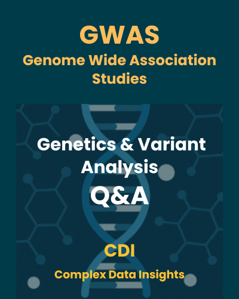

---
title:
  - Learning GWAS One Step at a Time with R
subtitle: |
  | {width=75%}
  | Last updated: `r format(Sys.Date(), "%B %d, %Y")`
knit: bookdown::render_book
site: bookdown::bookdown_site
documentclass: book
csl: 
  - library/apa.csl
bibliography:
  - library/references.bib
classoption: openany
citation_package:
  - natbib
  - biblatex
  - amsplain
colorlinks: yes
css: 
  - style.css
always_allow_html: yes
fig_caption: yes
fontsize: 12pt
geometry: margin=1in
indent: no
keep_tex: yes
link-citations: yes
mainfont: Times New Roman
biblio-style: apalike
spacing: double
pandoc_args: ["--variable=linestretch:2"]
description:
github-repo: "https://github.com/datainsights/cdi-gwas/"
favicon: "favicon.ico"
---

#  {-}

# Welcome to CDI – GWAS for Population Health {-}

Welcome to the **Genome-Wide Association Studies (GWAS) Q&A Guide**, part of the Complex Data Insights (CDI) series.

GWAS is a powerful approach used to identify genetic variants linked to traits and diseases across populations. By scanning the entire genome, GWAS helps researchers uncover associations between specific genetic markers (like SNPs) and observable traits — such as height, cholesterol levels, asthma, diabetes, cancer risk, **etc**. — across diverse populations.

This guide focuses on the data-driven steps involved in conducting GWAS, from quality control and population structure analysis to association testing and interpretation. Using real genotype–phenotype datasets, you’ll gain hands-on experience with tools like **PLINK**, **R**, and **Python**.

GWAS plays a central role in **population health genomics**, supporting risk prediction, public health research, and equitable precision medicine — especially when studies include diverse populations.

Whether you're preparing datasets, interpreting results, or exploring research applications, this guide helps you build your skills — one question at a time.

---

### 🌐 The CDI Learning Path {-}

This guide is part of the **Complex Data Insights (CDI)** learning system — an open educational project that combines:

- 📘 **Free learning content**, licensed under [CC BY 4.0](https://creativecommons.org/licenses/by/4.0/) (Creative Commons Attribution)  
- 💻 **Code and scripts**, licensed under the [MIT License](https://opensource.org/license/mit/)

You're free to use, adapt, and redistribute this material for personal, academic, or non-commercial purposes — with proper attribution to **Complex Data Insights (CDI)**.

CDI breaks down complex topics into four progressive layers, designed to be explored individually or as an integrated journey:

- 🔍 **EDA (Exploratory Data Analysis)**  
  Understand your data — explore its structure, patterns, and quirks.

- 📊 **VIZ (Visualization)**  
  Communicate findings through clear and compelling visuals.

- 📐 **STATS (Statistical Analysis)**  
  Test hypotheses and quantify uncertainty using sound statistical methods.

- 🤖 **ML (Machine Learning)**  
  Build models to predict, classify, and uncover deeper insights.

**CDI helps you grow — one Q&A at a time.**